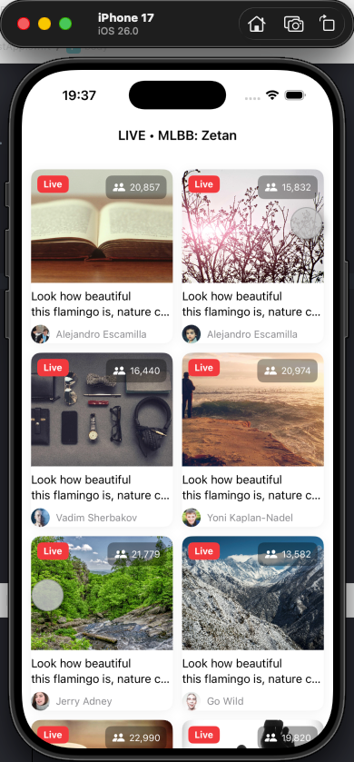
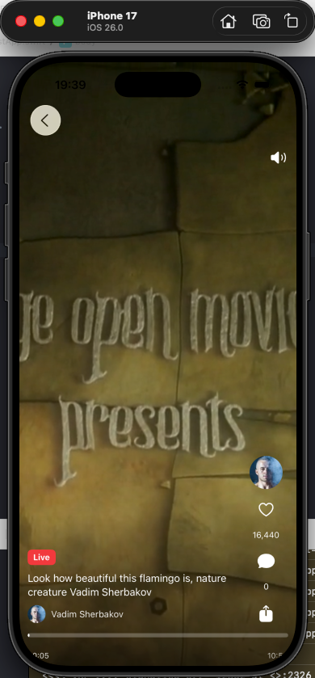

# ByteTest

## 概述

- 两列视频卡片流，支持上下滑动与点击到全屏播放页。
- 异步图片加载、网络数据获取与本地缓存；采用工厂模式与单例模式组织核心逻辑。
- 播放页沉浸式 UI，支持点击暂停/恢复、静音切换、点赞、进度条拖动与时间显示。

## 分层结构
- UI 层：`ByteTest/UI/`
  - `ContentView.swift` 列表与导航
  - `VideoCardView.swift` 卡片组件
  - `VideoPlayerView.swift` 全屏播放页面
- Core 层：`ByteTest/Core/`
  - `VideoItem.swift` 数据模型：包含`VideoItem` 字段`id、coverUrl、tag、title、avatarUrl、nickname、playUrl、viewsCount`
  - `VideoListViewModel.swift` 视图模型
  - `VideoRepository.swift` 仓库（网络 + 缓存）
  - `NetworkClient.swift` 网络单例
  - `DataStorage.swift` 存储单例
  - `VideoFactory.swift` 工厂（远端结构到模型）
  - `ServiceFactory.swift` 服务工厂（组装仓库与 VM）
  - `AppConstants.swift` 常量（播放地址与 Feed URL）
- 程序入口：`ByteTest/ByteTestApp.swift`

## 数据
- 触发加载：`ContentView` 出现时调用 `viewModel.load()`（`ByteTest/UI/ContentView.swift）
- 视图模型：`VideoListViewModel.load()` 异步从仓库获取并发布 `items`（`ByteTest/Core/VideoListViewModel.swift`）
- 仓库：远程请求 → 工厂映射 → 写入缓存 → 返回（`ByteTest/Core/VideoRepository.swift`）
- 网络：通用 `getDecodable` 解码 JSON（`ByteTest/Core/NetworkClient.swift`）
- 工厂：将 `RemoteImageInfo` 转为 `VideoItem`（`ByteTest/Core/VideoFactory.swift`）
- 存储：JSON 原子写入与读取（`ByteTest/Core/DataStorage.swift`）

## UI 交互
- 两列网格与导航：`ByteTest/UI/ContentView.swift`
- 卡片封面与信息：`ByteTest/UI/VideoCardView.swift`
- 播放：`VideoPlayerView` 全屏播放器 `AVPlayerViewController`（`ByteTest/UI/VideoPlayerView.swift`）
- 点击暂停/继续：透明点击层 + 可点击播放图标（`ByteTest/UI/VideoPlayerView.swift`）
- 进度条：自定义 `UISlider`、时间显示与拖动 seek（`ByteTest/UI/VideoPlayerView.swift`）

## 网络与缓存
- 源与常量：播放源 `PlayUrl`（HTTPS）在 `ByteTest/Core/AppConstants.swift`；图片列表源 `VideosFeedUrl` 在 `ByteTest/Core/AppConstants.swift`。
- 策略模型：远端优先、写入直通（write-through）、失败回退到本地缓存；缓存采用类型安全的 JSON 文件（`Documents/videos.json`）。
- 端到端流程：
  - 触发加载：`ContentView` 出现后调用 `VideoListViewModel.load()`（`ByteTest/Core/VideoListViewModel.swift`）。
  - 拉取远端：仓库在 `fetchVideos()` 中用 `NetworkClient.getDecodable` 拉取并解码（`ByteTest/Core/VideoRepository.swift`，`ByteTest/Core/NetworkClient.swift`）。
  - 结构映射：远端 `RemoteImageInfo` 由工厂转为领域模型 `VideoItem`（`ByteTest/Core/VideoFactory.swift`）。
  - 写入缓存：成功获取后即写入 JSON（原子写入避免半写状态）（`ByteTest/Core/DataStorage.swift`）。
  - 失败回退：网络异常时读取本地缓存，若存在则返回，否则返回空数组（`ByteTest/Core/VideoRepository.swift`，`ByteTest/Core/DataStorage.swift`）。
- 关键实现：
  - `NetworkClient.getDecodable` 使用 `URLSession.shared.data(from:)` 与 `HTTPURLResponse` 状态校验，保障远端返回有效（`ByteTest/Core/NetworkClient.swift`）。
  - `DataStorage.saveVideos` 原子写入，`DataStorage.loadVideos` 类型安全解码（`ByteTest/Core/DataStorage.swift`）。
  - `VideoRepository.fetchVideos` 统一编排远端与缓存，屏蔽上层复杂性（`ByteTest/Core/VideoRepository.swift`）。
- 并发与主线程：`VideoListViewModel` 使用 `@MainActor` 与 `Task` 保证 UI 更新在主线程执行，网络与 IO 异步进行（`ByteTest/Core/VideoListViewModel.swift`）。

## 设计模式
- Factory（工厂）：
  - 角色：将远端结构 `RemoteImageInfo` 转成领域模型 `VideoItem`，统一默认值。
  - 实现：`VideoFactory.makeItems(from:)`（`ByteTest/Core/VideoFactory.swift`）。
  - 好处：解耦远端数据形态与 UI，便于后续切换数据源或扩充字段。
- Singleton（单例）：
  - 角色：共享无状态或轻状态服务，例如网络与存储。
  - 实现：`NetworkClient.shared`（`ByteTest/Core/NetworkClient.swift`），`DataStorage.shared`（`ByteTest/Core/DataStorage.swift`）。
  - 取舍：便于全局复用，但测试时需支持依赖注入；本项目通过仓库构造函数可覆盖默认单例（`ByteTest/Core/VideoRepository.swift`）。
- MVVM：
  - 角色：`VideoListViewModel` 提供可观察状态与加载动作，视图订阅 `items` 展示（`ByteTest/Core/VideoListViewModel.swift`）。
  - 好处：分离视图与数据逻辑，便于扩展与测试。

## 命名规范
- 类型/文件：大驼峰；变量/方法：小驼峰；常量/枚举成员：大驼峰。

## 构建要求
- iOS 16.0+

## 运行与验证
- Xcode 构建运行，Simulator中运行验证。
